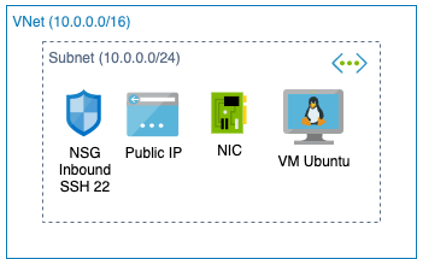
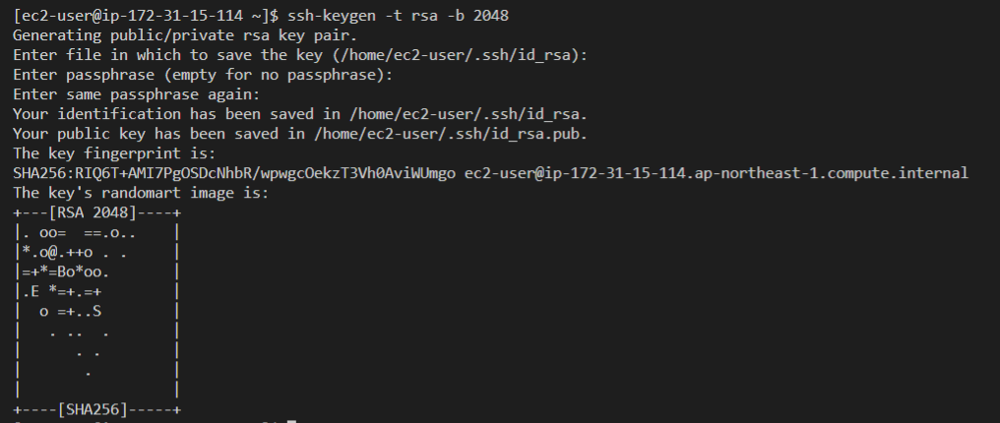
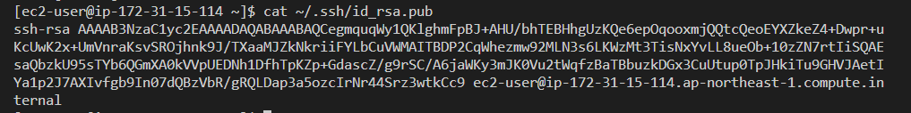
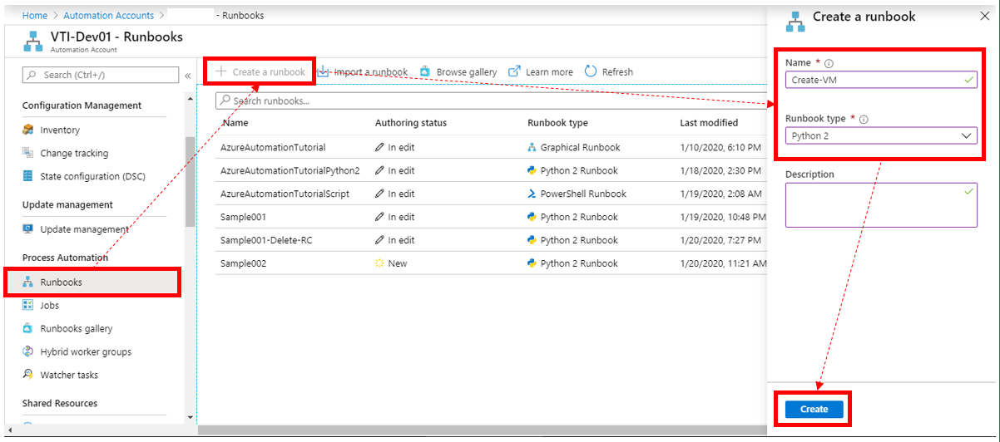
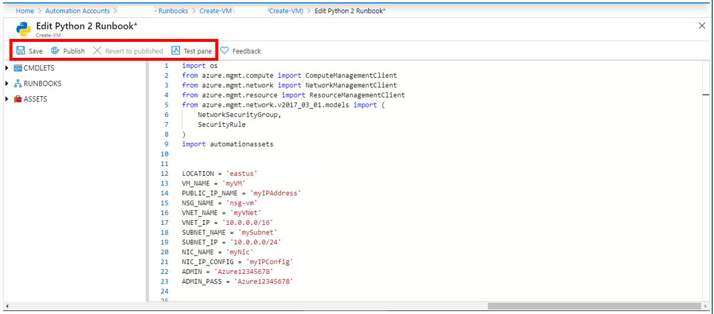
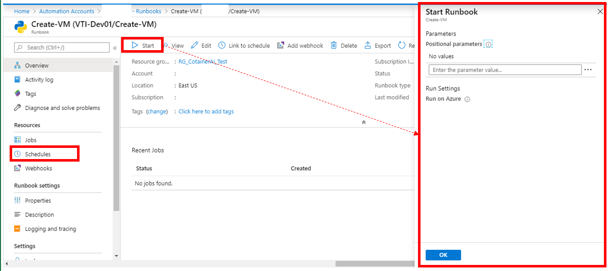

## I. 構成図


### 1. 環境情報：
- VNET_IP： '10.0.0.0/16'
- SUBNET_IP： '10.0.0.0/24'
- VM_IP: '10.0.0.10'
- VM：linux-data-science-vm-ubuntu
- NSG：
    - Inbound：SSH Allow port 22

### 2. 注意項目
- Resource_group_name、ADMINとKey-Pathは環境に変更される
- VMにログインするため、KeyPem使用可能。
- Private IP指定可能

## II. 作業流れ	
1. Key PEM 作成
2. AutomationのRunbooksを作成
3. Runbooksにコード入れ、実行
4. Runbooks実行オプションを調べ
5. VM削除コード

## III. 実際作業
### 1. Key PEM 作成
- ローカルでKey PEM 作成：
    
    `ssh-keygen -t rsa -b 2048`
    
    

    `cat ~/.ssh/id_rsa.pub`

- [ssh-rsa ....]をコピーして、以下のコードのkey_dataに切り替える

    
### 2. AutomationのRunbooksを作成
- Create Azure Automation Runbooks

    

    ```
    import os
    from azure.mgmt.compute import ComputeManagementClient
    from azure.mgmt.network import NetworkManagementClient
    from azure.mgmt.resource import ResourceManagementClient
    from azure.mgmt.network.v2017_03_01.models import (
        NetworkSecurityGroup,
        SecurityRule
    )
    import automationassets

    GROUP_NAME = 'Resource_group_name'
    LOCATION = 'eastus'
    VM_NAME = 'myvm'
    VM_IP = '10.0.0.10'
    PUBLIC_IP_NAME = 'myIPAddress'
    NSG_NAME = 'nsg-vm'
    VNET_NAME = 'myVNet'
    VNET_IP = '10.0.0.0/16'
    SUBNET_NAME = 'mySubnet'
    SUBNET_IP = '10.0.0.0/24'
    NIC_NAME = 'myNic'
    NIC_IP_CONFIG = 'myIPConfig'
    ADMIN = 'ec2-user'
    key_data = 'ssh-rsa AAAAB3NzaC1yc2EAAAADAQABAAAB/RVQceWPfIUWpnSDoA4J131grOAsg4L8EDciLwXn7KVMkBAqbV3mJ4RO1w9rxVlS6r0kBMbB55KnDKPxPV1XWzU1dFeHjsIux1yTaE/g4S1LDOetATsTwiPQ25zP6ZkvzGOwZhUatBHik+z9UY2dOR7LZVoOAzTX2YLdJtV6a4GP8VthEdfNazccif6Fa6YUbM42ppY7MEOnf4dKPrJbXCztghEAS4DbmtY83DT0WCplQRc8Ksvi6JdwBtWAfR89Zln4uXEGEpGLmG/eTtXQP8/k4f6mDDMBk33J4c02a1xEiGL2pxfAc6lA3dUNmQrxc5Zyv09qDbZ8FoGfa4cbuUD5QrPqS4ldSSjAJiMj87/1KqQZ1v9s6dZtKaWg7wf0V5OPnLFzn1hvA5efL8BUv55pMuf1R6NpsjrQenG5LvBwKROTA/x13up7OWBWvG0vMgxrhZ+43vauWpGGJlveNlOv7A49H8QGiLYfmnp969JvigDL+COpOtNnjyg/gV6ztC6fQMt1lMCefqnk6+SYOuYbpGUJgndnr2JqZbBNVGIlIsCSsSPTwx4YZLmScws7eyBkbGA65Uvb3DZy3DLf/lGdwUgGuOvbs1C7wA2flzKr4Gq/RfDNaZHncaXqWIH3B+4he/Wg6MnYsO6eFX4+4wjbF60AmdP5aKIVU0aL'

    def get_automation_runas_credential(runas_connection):
        from OpenSSL import crypto
        import binascii
        from msrestazure import azure_active_directory
        import adal

        # Get the Azure Automation RunAs service principal certificate
        cert = automationassets.get_automation_certificate("AzureRunAsCertificate")
        pks12_cert = crypto.load_pkcs12(cert)
        pem_pkey = crypto.dump_privatekey(
            crypto.FILETYPE_PEM, pks12_cert.get_privatekey())

        # Get run as connection information for the Azure Automation service principal
        application_id = runas_connection["ApplicationId"]
        thumbprint = runas_connection["CertificateThumbprint"]
        tenant_id = runas_connection["TenantId"]

        # Authenticate with service principal certificate
        resource = "https://management.core.windows.net/"
        authority_url = ("https://login.microsoftonline.com/" + tenant_id)
        context = adal.AuthenticationContext(authority_url)
        return azure_active_directory.AdalAuthentication(
            lambda: context.acquire_token_with_client_certificate(
                resource,
                application_id,
                pem_pkey,
                thumbprint)
        )

    runas_connection = automationassets.get_automation_connection(
        "AzureRunAsConnection")
    credentials = get_automation_runas_credential(runas_connection)
    SUBSCRIPTION_ID = str(runas_connection["SubscriptionId"])

    resource_group_client = ResourceManagementClient(
        credentials,
        SUBSCRIPTION_ID
    )
    network_client = NetworkManagementClient(
        credentials,
        SUBSCRIPTION_ID
    )
    compute_client = ComputeManagementClient(
        credentials,
        SUBSCRIPTION_ID
    )

    def create_public_ip_address(network_client):
        public_ip_addess_params = {
            'location': LOCATION,
            'public_ip_allocation_method': 'Dynamic'
        }
        creation_result = network_client.public_ip_addresses.create_or_update(
            GROUP_NAME,
            PUBLIC_IP_NAME,
            public_ip_addess_params
        )

        return creation_result.result()

    creation_result = create_public_ip_address(network_client)

    def create_network_security_group(network_client):
        params_create = NetworkSecurityGroup(
                location=LOCATION,
                security_rules=[
                    SecurityRule(
                        name='ssh',
                        access='allow',
                        description='test security rule',
                        destination_address_prefix='*',
                        destination_port_range='22',
                        direction='inbound',
                        priority=100,
                        protocol='tcp',
                        source_address_prefix='*',
                        source_port_range='*',
                    ),
                ],
            )

        result_create_NSG = network_client.network_security_groups.create_or_update(
                GROUP_NAME,
                NSG_NAME,
                params_create,
            )

        return result_create_NSG.result()

    creation_result = create_network_security_group(network_client)

    def create_vnet(network_client):
        vnet_params = {
            'location': LOCATION,
            'address_space': {
                'address_prefixes': [VNET_IP]
            }
        }
        creation_result = network_client.virtual_networks.create_or_update(
            GROUP_NAME,
            VNET_NAME,
            vnet_params
        )
        return creation_result.result()

    creation_result = create_vnet(network_client)

    def create_subnet(network_client):
        subnet_params = {
            'address_prefix': SUBNET_IP
        }
        creation_result = network_client.subnets.create_or_update(
            GROUP_NAME,
            VNET_NAME,
            SUBNET_NAME,
            subnet_params
        )

        return creation_result.result()

    creation_result = create_subnet(network_client)

    def create_nic(network_client):
        nsg_id = network_client.network_security_groups.get(
            GROUP_NAME,
            NSG_NAME
        )
        subnet_info = network_client.subnets.get(
            GROUP_NAME,
            VNET_NAME,
            SUBNET_NAME
        )
        publicIPAddress = network_client.public_ip_addresses.get(
            GROUP_NAME,
            PUBLIC_IP_NAME
        )
        nic_params = {
            'location': LOCATION,
            'ip_configurations': [{
                'name': NIC_IP_CONFIG,
                'public_ip_address': publicIPAddress,
                'private_ip_allocation_method': 'Static',
                'private_ip_address': VM_IP,
                'subnet': {
                    'id': subnet_info.id
                }
            }],
            'network_security_group': {
                'id': nsg_id.id
            }
        }
        creation_result = network_client.network_interfaces.create_or_update(
            GROUP_NAME,
            NIC_NAME,
            nic_params
        )
        return creation_result.result()

    creation_result = create_nic(network_client)

    def create_vm(network_client, compute_client):
        nic = network_client.network_interfaces.get(
            GROUP_NAME,
            NIC_NAME
        )
        vm_parameters = {
            'location': LOCATION,
            'os_profile': {
                'computer_name': VM_NAME,
                'admin_username': ADMIN,
                'linux_configuration': {
                    'disable_password_authentication': True,
                    'ssh': {
                        'public_keys': [{
                            'path': '/home/ec2-user/.ssh/authorized_keys',
                            'key_data': key_data
                        }]
                    }
                }
            },
            'hardware_profile': {
                'vm_size': 'Standard_DS3_v2'
            },
            'storage_profile': {
                'image_reference': {
                    'publisher': 'microsoft-dsvm',
                    'offer': 'linux-data-science-vm-ubuntu',
                    'sku': 'linuxdsvmubuntu',
                    'version': 'latest'
                },
            },
            'network_profile': {
                'network_interfaces': [{
                    'id': nic.id
                }]
            }
        }
        creation_result = compute_client.virtual_machines.create_or_update(
            GROUP_NAME,
            VM_NAME,
            vm_parameters
        )
        return creation_result.result()

    creation_result = create_vm(network_client, compute_client)
    ```
### 3. Runbooksにコード入れ、実行
- 上記のコードを入れてから、「Save」と「Publish」へ進む
Publishする前に、コード実行するため「Test pane」が使える。

    

### 4. Runbooks実行オプションを調べ
- 実行オプション：
- 手動：Start→OK
- オートメーション: Schedulesにジョブ設定することができる

    

### 5. VM削除コード
- 作成したリソースを削除するため以下のコード使う
    ```
    import os
    from azure.mgmt.compute import ComputeManagementClient
    from azure.mgmt.network import NetworkManagementClient
    from azure.mgmt.resource import ResourceManagementClient
    from azure.mgmt.network.v2017_03_01.models import (
        NetworkSecurityGroup,
        SecurityRule
    )
    import automationassets

    GROUP_NAME = 'Resource_group_name'
    LOCATION = 'eastus'
    VM_NAME = 'myvm'
    PUBLIC_IP_NAME = 'myIPAddress'
    NSG_NAME = 'nsg-vm'
    VNET_NAME = 'myVNet'
    VNET_IP = '10.0.0.0/16'
    SUBNET_NAME = 'mySubnet'
    SUBNET_IP = '10.0.0.0/24'
    NIC_NAME = 'myNic'
    NIC_IP_CONFIG = 'myIPConfig'

    def get_automation_runas_credential(runas_connection):
        from OpenSSL import crypto
        import binascii
        from msrestazure import azure_active_directory
        import adal

        # Get the Azure Automation RunAs service principal certificate
        cert = automationassets.get_automation_certificate("AzureRunAsCertificate")
        pks12_cert = crypto.load_pkcs12(cert)
        pem_pkey = crypto.dump_privatekey(
            crypto.FILETYPE_PEM, pks12_cert.get_privatekey())

        # Get run as connection information for the Azure Automation service principal
        application_id = runas_connection["ApplicationId"]
        thumbprint = runas_connection["CertificateThumbprint"]
        tenant_id = runas_connection["TenantId"]

        # Authenticate with service principal certificate
        resource = "https://management.core.windows.net/"
        authority_url = ("https://login.microsoftonline.com/" + tenant_id)
        context = adal.AuthenticationContext(authority_url)
        return azure_active_directory.AdalAuthentication(
            lambda: context.acquire_token_with_client_certificate(
                resource,
                application_id,
                pem_pkey,
                thumbprint)
        )

    runas_connection = automationassets.get_automation_connection(
        "AzureRunAsConnection")
    credentials = get_automation_runas_credential(runas_connection)
    SUBSCRIPTION_ID = str(runas_connection["SubscriptionId"])

    resource_group_client = ResourceManagementClient(
        credentials,
        SUBSCRIPTION_ID
    )
    network_client = NetworkManagementClient(
        credentials,
        SUBSCRIPTION_ID
    )
    compute_client = ComputeManagementClient(
        credentials,
        SUBSCRIPTION_ID
    )
    result = compute_client.virtual_machines.delete(
        GROUP_NAME, 
        VM_NAME)
    result.wait()
    result = network_client.network_interfaces.delete(
        GROUP_NAME,
        NIC_NAME
    )
    result.wait()
    result = network_client.public_ip_addresses.delete(
        GROUP_NAME,
        PUBLIC_IP_NAME
    )
    result.wait()
    result = network_client.network_security_groups.delete(
        GROUP_NAME,
        NSG_NAME
    )
    result.wait()
    result = network_client.virtual_networks.delete(
        GROUP_NAME,
        VNET_NAME
    )
    result.wait()
    ```