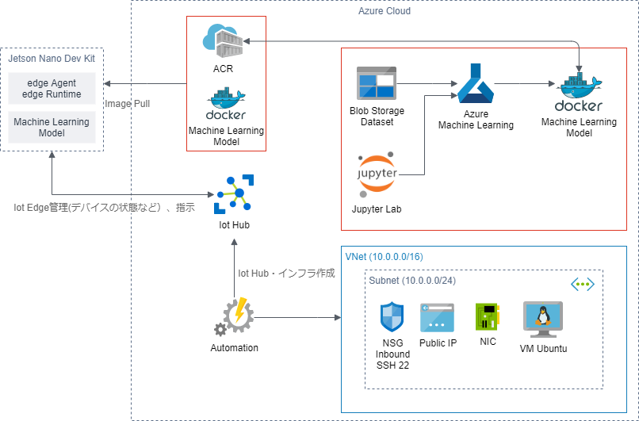

## AzureによるIoTデバイスへドッカーコンテナーを展開するMLモジュール開発
## I. 全体構成図

## II. 詳細項目
1. ACR&Iot Hub作成
    - Azure AutomationでACRとIot Hub作成
2. Azure Iot Edge登録
    - Azure Iot HubにAzure Iot Edgeを登録
3. [Azureインフラ作成](3_Azureインフラ作成)
    - インフラをコード化
4. [AML学習](4_AML学習/1_main.ipynb)
    - 猫の画像を区別する画像認識モデルを構築
5. [AMLモジュールのコンテナー化](5_AMLモジュールのコンテナー化.md)
    - AMLモジュールコンテナ化
    - ACRへ登録
6. [AMLコンテナーを展開](6_AMLコンテナーを展開.md)
    - エッジへのデプロイ
7. [KerasモデルをONNXに変換](7_keras_onnx.ipynb)
    - KerasモデルをONNXに変換
    
## III. 参考:
1. An end-to-end solution using Azure Machine Learning and IoT Edge:
    - https://docs.microsoft.com/en-us/azure/iot-edge/tutorial-machine-learning-edge-01-intro

2. AzureML-Bootcamp:
    - https://github.com/konabuta/AzureML-Bootcamp